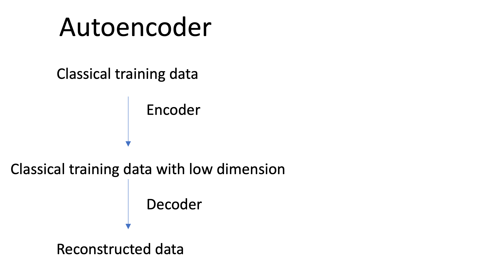
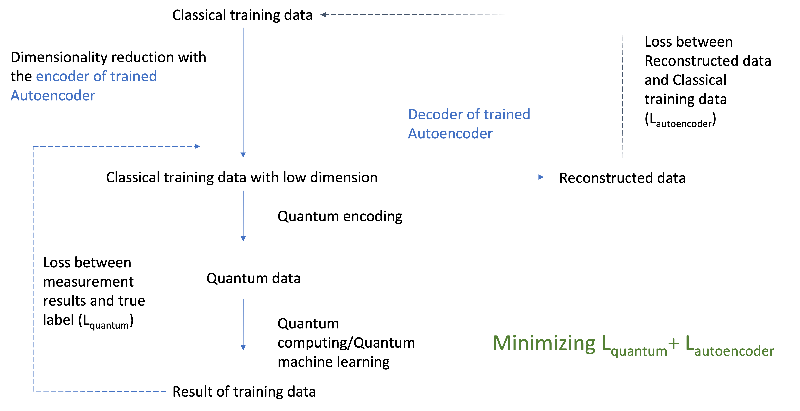

# Quantum C2C

## Intriduction

In a noisy intermediate-scale quantum (NISQ) era, quantum processors contain about 50 to a few hundred qubits. However, dimension of some classical data could be far larger. Hence, for a project of quantum computing (QC) or quantum machine learning (QML), data compression of classical data would be a must in a NISQ era. 

In previous literatures related to QC or QML, most techniques of data compression of classical data are simple or non-parametric, e.g. downsampling image resolutions [1] or principal components analysis [2]. These may lose much information of original classical data. After performing dimension reduction, quantum encoding (quantum embedding) would be used to transform classical data into quantum data. Then quantum data go through a quantum circuit.

Based on universal approximation theorems, deep learning (DL) could approximate any function. Here, we hypothesized that DL would learn the optimized parameters to compress classical data for QC/QML. Information loss would be minimized during the data compression if with deep learning. We argued that each quantum circuit would be suitable for different data compression models (both hyperparemeters and parameters). One could train and design different DL data compression model structures for several quantum circuits.

**We first proposed to use Multitask Learning on QC/QML to simultaneously minimize the loss of autoencoder and loss of performance of QC/QML.** Furthurmore, we devoloped a tool function that one could perform end-to-end training with inputting classical data. Users could use the tool withiut complicated coding.
Please see the deck to introduce Quantum C2C.

## Methods

 We proposed the methodology, Quantum C2C , as the following steps:
1. Splitting the data into training data and test data.
2. Using deep learning (autoencoder) to perform dimensionality reduction.

3. Performing quantum encoding.

4. Inputting the quantum data into quantum circuit of QC/QML.

5. Performing quantum measurement.

6. Calculating the loss between the measurement result and true label and loss between Reconstructed data and Classical training data .

7. Repeating the above steps for several epochs, we could get the model with the minimized loss with optimization.

8. Using the proposed deep learning model to perform dimensionality reduction for the future classical data including test data.

## Usage

### 1. Input:

#### a. X_train_autoencoder: 
 Classical Data for the first autoencoder training (step 2 in the Methods). The type is data type of PyTorch. X_train_autoencoder.data is data and  X_train_autoencoder.targets is targets.
 
####  b. X_train:  
 Classical Data for whole model training. The type is data type of PyTorch. X_train.data is data and  X_train.targets is targets.
 
####  c. X_test:  
 Classical Data for whole model testing. The type is data type of PyTorch. X_test.data is data and  X_test.targets is targets.
 
####  d. autoencoder_model: 
 PyTorch model of autoencoder. Required variables are input_shape (shape of a input data) and encoded_len (length of encoded data). You could use a simple autoencoder by "from quantum_c2c import AutoEncoder."
 
####  e. quantum_curcuit: 
 Qiskit's "Quantum-Classical Class" with PyTorch (Please see the details in [link](https://qiskit.org/textbook/ch-machine-learning/machine-learning-qiskit-pytorch.html).) Required variables are encoded_len (length of encoded data.  You could use a simple Quantum-Classical Class by "from quantum_c2c import Hybrid"
 
####  f. epochs: 
 Epochs for the first autoencoder training and whole model training. Default is 10.

### 2. Output:

####  a. trained_autoencoder_model
 
####  b. y_predicted

## Example

You could view the example in 

## Reference

[1] Jiang, Weiwen, Jinjun Xiong, and Yiyu Shi. "A co-design framework of neural networks and quantum circuits towards quantum advantage." Nature communications 12.1 (2021): 1-13.

[2] Wu, Sau Lan, et al. "Application of quantum machine learning using the quantum variational classifier method to high energy physics analysis at the lhc on ibm quantum computer simulator and hardware with 10 qubits." Journal of Physics G: Nuclear and Particle Physics (2021).

[3] https://qiskit.org/textbook/ch-machine-learning/machine-learning-qiskit-pytorch.html
